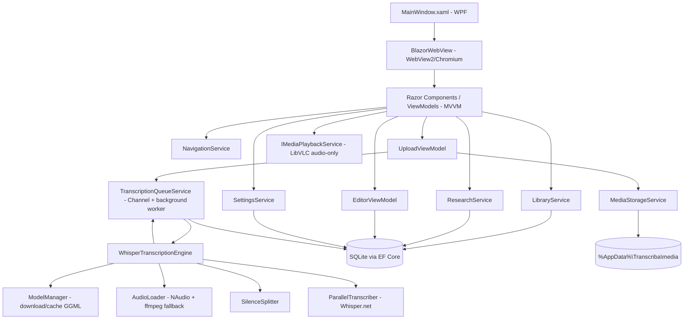

# Transcriba Desktop Design

**Spec**: `.specs/features/transcriba-desktop/spec.md`
**Status**: Draft

---

## Architecture Overview

> **Nota de revisão (AD-005)**: a implementação anterior em Avalonia foi concluída (50/50 tasks) mas sofria de um crash fatal e não determinístico do runtime Windows (`Internal CLR error 0x80131506`, ver `.specs/STATE.md`). A stack de apresentação foi trocada para **Blazor Hybrid** (WPF host + `BlazorWebView`/WebView2). `Transcriba.Core` (motor de transcrição, dados, mídia, serviços de domínio) é 100% reaproveitado sem alteração — apenas `Transcriba.App` é reescrito. As seções abaixo foram atualizadas para refletir a nova stack; o restante do design (Code Reuse Analysis, Data Models, Error Handling, Tech Decisions) permanece válido.

App desktop **WPF** hospedando um `BlazorWebView` (WebView2/Chromium) com Generic Host (`Microsoft.Extensions.Hosting`) para DI e serviços de background — mesmo padrão de hosting da tentativa anterior, só a superfície de UI muda. A UI (Razor components, HTML/CSS herdado quase verbatim do protótipo) nunca chama o motor de transcrição diretamente: ela enfileira um job na `TranscriptionQueueService`, que processa em background reaproveitando quase 1:1 a lógica do `transcrever.cs` (download de modelo GGML, carga/resample de áudio via NAudio/ffmpeg, VAD por silêncio, transcrição paralela com Whisper.net). Persistência via EF Core + SQLite. Reprodução de mídia via LibVLC em modo **somente áudio** (sem `VideoView`) — decisão original (AD-002) que continua válida independente da UI, já que o player do protótipo nunca exibe vídeo, só controla áudio; a nova stack elimina a preocupação original de "airspace" (não há mais controles Avalonia nativos sobrepostos), mas manter o playback só-áudio ainda simplifica o componente e é fiel ao protótipo.

Componentes de UI stateful (ViewModels com `CommunityToolkit.Mvvm`, `ObservableObject`/`RelayCommand`) continuam existindo e são registrados no mesmo `IServiceCollection` usado pelo `BlazorWebView`, permitindo reaproveitar a lógica de estado/comando já escrita nos ViewModels Avalonia (a maior parte do porte é troca de `.axaml` por `.razor`, não reescrita de lógica). Interações que hoje são JS puro no protótipo (drag&drop de upload, canvas da waveform, popups de ícone/cor) são portadas para Razor + JS interop pontual (`IJSRuntime`) apenas onde não há equivalente direto em C#/Blazor (ex.: desenho de canvas).



### Estrutura de projeto revisada

| Antes (Avalonia) | Depois (Blazor Hybrid) |
| --- | --- |
| `Transcriba.App` (`Avalonia`, `Avalonia.Desktop`, `Avalonia.Themes.Fluent`) | `Transcriba.App` (`Microsoft.NET.Sdk.Razor`, `net10.0-windows10.0.17763.0`, `Microsoft.AspNetCore.Components.WebView.Wpf`) |
| `App.axaml` / `App.axaml.cs` | `App.xaml` / `App.xaml.cs` (WPF) — bootstrap do `Host` idêntico, troca só o `AppBuilder` Avalonia por `Application` WPF |
| `MainWindow.axaml` (shell + sidebar) | `MainWindow.xaml` hospedando `<blazor:BlazorWebView HostPage="wwwroot/index.html">` com `RootComponent` apontando pro shell Razor (`App.razor`/`MainLayout.razor`) |
| `Views/*.axaml` + `ViewModels/*.cs` | `Components/Pages/*.razor` (ou `Components/*.razor`) reaproveitando o CSS global do protótipo (`wwwroot/app.css`, portado quase verbatim); `ViewModels/*.cs` mantidos como estão sempre que possível |
| `NavigationService` (troca `ContentArea`) | `NavigationService` equivalente via estado C# observável consumido pelos Razor components (ou roteamento Blazor simples, ver Design decisions abaixo) |
| Estilos QSS/Avalonia customizados por controle | CSS do protótipo direto em `wwwroot/`, sem tradução de linguagem de estilo |
| `Transcriba.Core` | **inalterado** |

---

## Code Reuse Analysis

### Existing Components to Leverage

| Component | Location (fonte) | Como usar |
| --- | --- | --- |
| `DividirPorSilencio`, `AgruparPartes`, `CalcularLimitesParalelos` | `transcrever.cs:465-611` | Portar quase sem alteração para `Transcriba.Core.Engine.SilenceSplitter` / `ChunkPlanner` — algoritmo já validado |
| `CarregarSamples16kHz`, `CarregarSamplesComFfmpeg`, `ConverterPcm16ParaFloat` | `transcrever.cs:290-366` | Portar para `Transcriba.Core.Engine.AudioLoader` |
| `GarantirModeloAsync`, `ObterNomeModelo` | `transcrever.cs:235-256` | Portar para `Transcriba.Core.Engine.ModelManager` |
| `GarantirFfmpeg`, `EncontrarFfmpeg`, `TentarInstalarFfmpeg` | `transcrever.cs:368-463` | Portar para `Transcriba.Core.Engine.FfmpegLocator` sem alteração de comportamento (mesmo fallback via winget) |
| `DetectarIdioma`, `CriarProcessor` | `transcrever.cs:265-288` | Portar para `Transcriba.Core.Engine.WhisperTranscriptionEngine`; detecção de idioma vira opcional (usada apenas se necessário no futuro — MVP força o idioma escolhido pelo usuário) |
| `FormatarSegmento`, `FormatarTempo` | `transcrever.cs:613-621` | Reaproveitar em `Transcriba.Core.Export.TxtExporter` para manter o mesmo formato de saída |
| Paleta de ícones/cores/tags (`PAGE_ICONS`, `PAGE_COLORS`, `TRANS_ICONS`, `TAG_COLORS`) | `transcriba-v2-icons-transcriptions.html:352-353` | Portar como constantes estáticas em `Transcriba.Core.Catalogs` (`IconCatalog`, `ColorCatalog`) |
| Lógica de "segmento ativo" (`highlightSegment`), split (`splitSegment`), merge (`mergeSegment`) | `transcriba-v2-icons-transcriptions.html:489-494` | Reimplementar em `SegmentEditingService`/`EditorViewModel` seguindo exatamente a mesma regra (ver Assumptions & Open Questions do spec) |

### Integration Points

| Sistema | Método de integração |
| --- | --- |
| Whisper.net (`Whisper.net.AllRuntimes`) | Referenciado diretamente em `Transcriba.Core`, mesma versão validada em `transcrever.cs` (1.9.1) |
| NAudio | Referenciado em `Transcriba.Core.Engine.AudioLoader` |
| ffmpeg (processo externo) | Chamado via `Process.Start`, mesma lógica de localização/instalação do POC |
| LibVLC | `LibVLCSharp` (core, sem `LibVLCSharp.Avalonia`/`VideoView`) + `VideoLAN.LibVLC.Windows` para binários nativos |
| SQLite | `Microsoft.EntityFrameworkCore.Sqlite`, arquivo único em `%AppData%\Transcriba\transcriba.db` |

---

## Components

### Transcriba.App (projeto WPF + Blazor Hybrid — apresentação)

- **Purpose**: `MainWindow.xaml` (host WPF mínimo com `BlazorWebView`) + Razor components (`Components/Pages/*.razor`) + ViewModels (MVVM, CommunityToolkit.Mvvm) + navegação da shell. CSS herdado do protótipo em `wwwroot/`.
- **Location**: `src/Transcriba.App/`
- **Principais ViewModels/Components**: `MainWindowViewModel`/`MainLayout.razor` (shell/sidebar), `DashboardViewModel`/`Dashboard.razor`, `ResearchPageViewModel`/`ResearchPage.razor`, `UploadViewModel`/`Upload.razor`, `RecordingViewModel`/`Recording.razor` (mockado), `EditorViewModel`/`Editor.razor`, `SettingsViewModel`/`Settings.razor`, `NewPageModalViewModel`/`NewPageModal.razor`, `IconPickerViewModel`/`IconPicker.razor`, `ColorPickerViewModel`/`ColorPicker.razor`, `SpeakerDropdownViewModel`/`SpeakerDropdown.razor`.
- **Dependencies**: `Transcriba.Core` (serviços de aplicação), `NavigationService`, `Microsoft.AspNetCore.Components.WebView.Wpf`.
- **Reuses**: ViewModels (lógica de estado/comando) reaproveitados quase 1:1 da implementação Avalonia descontinuada; CSS do protótipo `transcriba-v2-icons-transcriptions.html` reaproveitado quase verbatim.

### NavigationService

- **Purpose**: Troca a tela ativa no `ContentArea` da shell, equivalente ao `showScreen(id)` do protótipo.
- **Location**: `src/Transcriba.App/Services/NavigationService.cs`
- **Interfaces**:
  - `NavigateTo(ScreenKey key, object? parameter = null): void`
  - `CurrentScreen: ScreenKey` (observable)
- **Dependencies**: DI container para resolver ViewModels de destino.

### LibraryService

- **Purpose**: Consulta/filtra transcrições para o Dashboard (status, tag, busca textual).
- **Location**: `src/Transcriba.Core/Services/LibraryService.cs`
- **Interfaces**:
  - `GetTranscriptions(LibraryFilter filter): Task<IReadOnlyList<TranscriptionSummary>>`
  - `SearchText(string query, LibraryFilter filter): Task<IReadOnlyList<TranscriptionSummary>>`
- **Dependencies**: `IDbContextFactory<TranscribaDbContext>`.

### ResearchService

- **Purpose**: CRUD de pesquisas/teses e associação com transcrições.
- **Location**: `src/Transcriba.Core/Services/ResearchService.cs`
- **Interfaces**:
  - `CreateAsync(string title, string icon, string colorName): Task<ResearchPage>`
  - `GetByIdAsync(int id): Task<ResearchPage?>`
  - `DeleteAsync(int id): Task` (P2 — desassocia transcrições em vez de excluí-las)

### MediaStorageService

- **Purpose**: Copia arquivos de mídia importados/gravados para `%AppData%\Transcriba\media\{transcriptionId}\{arquivo}`.
- **Location**: `src/Transcriba.Core/Services/MediaStorageService.cs`
- **Interfaces**:
  - `CopyToAppDataAsync(string sourcePath, Guid transcriptionId): Task<string>` (retorna caminho local)
  - `DeleteMedia(Guid transcriptionId): void`

### TranscriptionQueueService

- **Purpose**: Fila de jobs de transcrição processados em background, com concorrência limitada, cancelamento e atualização de status/erro no banco.
- **Location**: `src/Transcriba.Core/Engine/TranscriptionQueueService.cs`
- **Interfaces**:
  - `Enqueue(TranscriptionJobRequest request): Guid` (retorna o Id da transcrição)
  - `Cancel(Guid transcriptionId): void`
  - `event EventHandler<TranscriptionStatusChanged>? StatusChanged`
- **Dependencies**: `System.Threading.Channels.Channel<TranscriptionJobRequest>`, `WhisperTranscriptionEngine`, `IDbContextFactory<TranscribaDbContext>`.
- **Concorrência**: no MVP, processa **1 job por vez** por padrão (configurável), pois o paralelismo interno do próprio `transcrever.cs` já assume uso exclusivo da máquina; jobs adicionais ficam com status "Em andamento" (na fila) até serem processados.

### WhisperTranscriptionEngine

- **Purpose**: Pipeline de transcrição real, porta direta da lógica de `transcrever.cs`.
- **Location**: `src/Transcriba.Core/Engine/WhisperTranscriptionEngine.cs` (+ `ModelManager.cs`, `AudioLoader.cs`, `SilenceSplitter.cs`, `FfmpegLocator.cs`)
- **Interfaces**:
  - `TranscribeAsync(TranscriptionJobRequest request, IProgress<EngineProgress> progress, CancellationToken ct): Task<TranscriptionResult>`
- **Dependencies**: Whisper.net, NAudio, ffmpeg (processo externo).
- **Reuses**: ver Code Reuse Analysis.

### IMediaPlaybackService / LibVlcPlaybackService

- **Purpose**: Reprodução de áudio (de qualquer arquivo de mídia, incluindo vídeo — só o áudio é reproduzido) com play/pause/seek/volume/velocidade, equivalente à barra de player do protótipo.
- **Location**: `src/Transcriba.Core/Media/IMediaPlaybackService.cs`, `src/Transcriba.Core/Media/LibVlcPlaybackService.cs`
- **Interfaces**:
  - `LoadAsync(string filePath): Task`
  - `Play(): void` / `Pause(): void`
  - `SeekTo(TimeSpan position): void`
  - `PlaybackRate: float` (1, 1.25, 1.5, 2)
  - `Volume: int` (0–100)
  - `event EventHandler<TimeSpan>? PositionChanged` (tick ~250ms)
  - `Duration: TimeSpan`
- **Dependencies**: `LibVLCSharp` (`LibVLC`, `MediaPlayer`, `Media`) — sem `VideoView`.

### SegmentEditingService

- **Purpose**: Regras de edição de segmentos (dividir, mesclar, atribuir locutor), replicando exatamente a semântica do protótipo.
- **Location**: `src/Transcriba.Core/Services/SegmentEditingService.cs`
- **Interfaces**:
  - `GetActiveSegment(IReadOnlyList<Segment> segments, TimeSpan currentPosition): Segment?` (último segmento com `Start <= currentPosition`)
  - `SplitAtCaret(Segment segment, int caretIndex): (Segment Before, Segment After)?` (retorna `null` se uma das partes ficaria vazia)
  - `MergeWithPrevious(IReadOnlyList<Segment> segments, Segment active): Segment?` (retorna `null` se `active` for o primeiro)
  - `AssignSpeaker(Segment segment, Speaker speaker): void`

### SpeakerService

- **Purpose**: Gerencia locutores **por transcrição** (ver Tech Decisions — escopo por transcrição, não global).
- **Location**: `src/Transcriba.Core/Services/SpeakerService.cs`
- **Interfaces**:
  - `GetSpeakersAsync(Guid transcriptionId): Task<IReadOnlyList<Speaker>>`
  - `CreateSpeakerAsync(Guid transcriptionId, string name): Task<Speaker>` (cor atribuída por ciclo de paleta, igual ao protótipo)

### ExportService (P2)

- **Purpose**: Exporta transcrição para TXT (mesmo formato do `transcrever.cs`), SRT e VTT.
- **Location**: `src/Transcriba.Core/Export/ExportService.cs`
- **Interfaces**:
  - `ExportTxtAsync(Guid transcriptionId, string destPath): Task`
  - `ExportSrtAsync(Guid transcriptionId, string destPath): Task`
  - `ExportVttAsync(Guid transcriptionId, string destPath): Task`

### SettingsService

- **Purpose**: Perfil + preferências (idioma padrão, identificar locutores, transcrição ao vivo, dispositivo, tema).
- **Location**: `src/Transcriba.Core/Services/SettingsService.cs`
- **Interfaces**:
  - `GetAsync(): Task<UserSettings>`
  - `UpdateAsync(Action<UserSettings> mutate): Task`

---

## Data Models

```csharp
public class ResearchPage
{
    public int Id { get; set; }
    public string Title { get; set; } = "";
    public string Icon { get; set; } = "📚";
    public string ColorName { get; set; } = "blue";   // chave em ColorCatalog
    public string? Description { get; set; }
    public DateTime CreatedAt { get; set; }
    public List<Transcription> Transcriptions { get; set; } = [];
}

public enum TranscriptionStatus { InProgress, Done, Error }
public enum ModelQuality { Standard, High }        // Padrão -> small, Alta -> large-v3
public enum SpeakerMode { Automatic, Off }
public enum ExecutionDevice { Auto, Cpu, Cuda, Vulkan }

public class Transcription
{
    public Guid Id { get; set; }
    public string Title { get; set; } = "";
    public string? Icon { get; set; }
    public TranscriptionStatus Status { get; set; }
    public string? ErrorMessage { get; set; }
    public DateTime CreatedAt { get; set; }
    public double DurationSeconds { get; set; }
    public string? MediaFilePath { get; set; }       // caminho copiado em %AppData%
    public string Language { get; set; } = "pt";
    public ModelQuality Quality { get; set; }
    public SpeakerMode SpeakerMode { get; set; }
    public int? ResearchPageId { get; set; }
    public ResearchPage? ResearchPage { get; set; }
    public List<Segment> Segments { get; set; } = [];
    public List<Speaker> Speakers { get; set; } = [];
    public List<Tag> Tags { get; set; } = [];
}

public class Segment
{
    public Guid Id { get; set; }
    public Guid TranscriptionId { get; set; }
    public double StartSeconds { get; set; }
    public double EndSeconds { get; set; }
    public string Text { get; set; } = "";
    public int SortOrder { get; set; }               // ordenação estável após split/merge
    public Guid? SpeakerId { get; set; }
    public Speaker? Speaker { get; set; }
}

public class Speaker
{
    public Guid Id { get; set; }
    public Guid TranscriptionId { get; set; }        // escopo por transcrição (ver Tech Decisions)
    public string Name { get; set; } = "";
    public string ColorHex { get; set; } = "#2eaadc";
}

public class Tag
{
    public int Id { get; set; }
    public string Name { get; set; } = "";
    public string ColorName { get; set; } = "blue";  // sempre "blue" para tags novas (fidelidade ao protótipo)
}

public class UserSettings
{
    public int Id { get; set; } = 1;                 // singleton row
    public string Name { get; set; } = "";
    public string Email { get; set; } = "";
    public string Institution { get; set; } = "";
    public string DefaultLanguage { get; set; } = "pt";
    public bool IdentifySpeakersDefault { get; set; } = true;
    public bool LiveTranscriptionEnabled { get; set; } = true; // inerte no MVP
    public ExecutionDevice Device { get; set; } = ExecutionDevice.Auto;
    public bool DarkTheme { get; set; }
}
```

**Relationships**: `ResearchPage 1—N Transcription (opcional)`; `Transcription 1—N Segment`; `Transcription 1—N Speaker` (locutores escopados à transcrição); `Segment N—1 Speaker (opcional)`; `Transcription N—N Tag`.

---

## Error Handling Strategy

| Error Scenario | Handling | User Impact |
| --- | --- | --- |
| ffmpeg ausente e instalação via winget falha | `WhisperTranscriptionEngine` lança exceção capturada pela fila; `Transcription.Status = Error`, mensagem com instrução manual (mesma do POC) | Card/editor mostra badge de erro + botão "Tentar novamente" |
| Download do modelo GGML falha (rede) | Exceção capturada, status Error, mensagem "Falha ao baixar modelo" | Mesmo acima |
| Arquivo de mídia corrompido/ilegível | `AudioLoader`/ffmpeg retornam erro, propagado como `TranscriptionException` | Mesmo acima |
| App fechado com job "Em andamento" | Ao iniciar, `TranscriptionQueueService` varre transcrições com `Status = InProgress` sem processo ativo e marca como `Error` ("Interrompida") | Usuário vê erro e pode tentar novamente, não fica "travado" |
| Dispositivo configurado (CUDA/Vulkan) indisponível no runtime | Fallback automático para CPU (`RuntimeOptions` do Whisper.net já suporta ordem de fallback); log de aviso | Transcrição roda normalmente, um pouco mais lenta |
| Formato de arquivo não suportado no upload | Validação antes de enfileirar, rejeita com mensagem | Zona de upload mostra erro, nada é copiado/enfileirado |
| Cancelamento de job pelo usuário (fora do MVP explícito, mas suportado pela API) | `CancellationToken` propagado ao pipeline | Status volta a permitir novo upload |

---

## Risks & Concerns

| Concern | Location (file:line) | Impact | Mitigation |
| --- | --- | --- | --- |
| `WhisperFactory` é custosa para carregar (modelo inteiro em memória); recarregar a cada job é caro | `transcrever.cs:42` | Latência extra a cada transcrição, especialmente com modelos `large-v3` | `TranscriptionQueueService` mantém um cache do último `WhisperFactory` carregado por `modelPath`, reaproveitando entre jobs consecutivos do mesmo modelo; libera ao trocar de modelo |
| Paralelismo interno de `CalcularLimitesParalelos` assume uso exclusivo da CPU/GPU da máquina | `transcrever.cs:543-558` | Rodar 2+ jobs simultâneos da fila sobrecarregaria os núcleos | Fila processa 1 job por vez por padrão (ver TranscriptionQueueService) |
| `DbContext` do EF Core não é thread-safe | novo código | Uso simultâneo do contexto por UI thread + worker de background pode corromper estado | Usar `IDbContextFactory<TranscribaDbContext>` e criar um `DbContext` por operação/escopo, nunca compartilhar instância entre threads |
| LibVLC exige binários nativos (`VideoLAN.LibVLC.Windows`) empacotados com o app | novo código | Sem os binários, playback falha silenciosamente | Referenciar o pacote NuGet como dependência do `Transcriba.App`/publish, documentar no README |
| `BlazorWebView` requer o runtime WebView2 instalado (já vem pré-instalado no Windows 10 1803+/11, mas pode faltar em imagens mínimas/Server) | novo código (AD-005) | App não inicia se o WebView2 Runtime não estiver presente | Detectar ausência no startup e mostrar mensagem clara com link do instalador Evergreen; documentar no README como pré-requisito |
| Comunicação entre Razor components e lógica de canvas (waveform) exige JS interop pontual (`IJSRuntime`) | novo código (AD-005) | Superfície pequena de JS residual, diferente do padrão 100% C# do restante do app | Isolar JS interop em um único módulo (`wwwroot/js/waveform.js`) com contrato mínimo, documentado como exceção deliberada |
| `GarantirFfmpeg` pode exigir prompt de elevação/UAC do winget em algumas máquinas | `transcrever.cs:394-419` | Instalação automática pode falhar silenciosamente em ambientes restritos | Mesma mensagem de fallback manual do POC, exibida como erro claro na UI (não apenas console) |
| Nenhuma cobertura de testes automatizados existe hoje (nem para `transcrever.cs`, nem para o protótipo) | N/A | Risco de regressão ao portar lógica | Tasks de Execute incluem testes unitários para `SilenceSplitter`, `SegmentEditingService` e `AgruparPartes`/`ChunkPlanner` (lógica pura, fácil de testar sem I/O) |

---

## Tech Decisions (only non-obvious ones)

| Decision | Choice | Rationale |
| --- | --- | --- |
| Escopo de `Speaker` (locutor) | **Por transcrição**, não global | O array `speakers` do protótipo é global só porque é dado mockado de demonstração de uma única transcrição; num app real, cada entrevista tem seus próprios participantes. Modelo de dados reflete a intenção, não a simplificação do mock. |
| Playback de vídeo | LibVLC **sem** `VideoView` (só `MediaPlayer` de áudio) | O protótipo nunca renderiza vídeo na tela do Editor — só controla áudio. Evita os problemas conhecidos de "airspace" do LibVLCSharp.Avalonia (pesquisado; ver referências) |
| Ordenação de segmentos | Campo `SortOrder` explícito (não apenas `StartSeconds`) | Split/merge podem gerar segmentos com tempos que não refletem ordem de edição real; um índice explícito evita ambiguidade |
| Concorrência de jobs de transcrição | 1 job ativo por vez (fila serial) no MVP | `transcrever.cs` calcula paralelismo assumindo uso exclusivo da máquina; rodar jobs em paralelo real quebraria essa premissa (ver Risks) |
| DI/Hosting | `Microsoft.Extensions.Hosting` (Generic Host) integrado ao `Avalonia.AppBuilder` | Padrão comum para apps Avalonia que precisam de DI + `BackgroundService`; mantém `TranscriptionQueueService` como hosted service gerenciado pelo mesmo ciclo de vida do app |
| ORM | EF Core + `Microsoft.EntityFrameworkCore.Sqlite` | Migrations automáticas facilitam evolução do schema; DbContext thread-safety mitigada via `IDbContextFactory` |

> **Project-level decisions:** As linhas acima (escopo de Speaker, playback sem VideoView, concorrência serial de jobs, EF Core + Generic Host) serão registradas em `.specs/STATE.md` como decisões de projeto (`AD-001` a `AD-004`) por afetarem qualquer feature futura que toque locutores, player, fila de transcrição ou camada de dados.

---

## Tips

- Reaproveitar o mais possível de `transcrever.cs` como está — o algoritmo já é validado; a mudança principal é orquestração (fila/eventos) e não a lógica interna do motor.
- Toda escrita no `TranscribaDbContext` a partir do worker de background deve usar `IDbContextFactory`, nunca a mesma instância usada pela UI.
